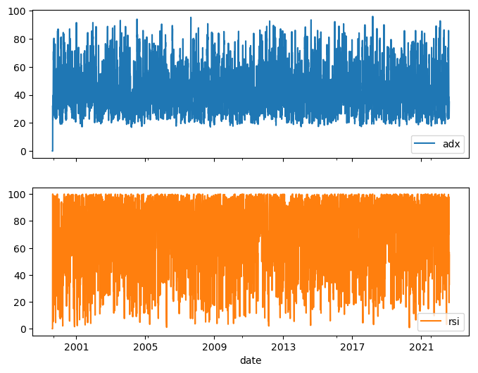
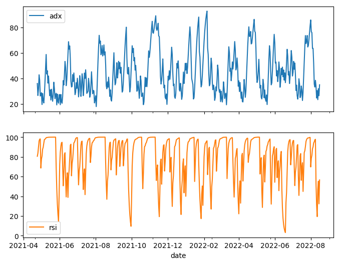

```python
import os
import datetime

import IPython
import IPython.display
import matplotlib as mpl
import matplotlib.pyplot as plt
import numpy as np
import pandas as pd
import seaborn as sns
import tensorflow as tf

mpl.rcParams['figure.figsize'] = (8, 6)
mpl.rcParams['axes.grid'] = False
```


```python
# show indicator tables for AAPL
!ls -lt data/AAPL/
```

    total 3168
    -rw-r--r--  1 ppfenning  staff  132433 Aug 17 18:25 PLUSDM.parquet
    -rw-r--r--  1 ppfenning  staff  132438 Aug 17 18:25 MINUSDM.parquet
    -rw-r--r--  1 ppfenning  staff  132430 Aug 17 18:24 MINUSDI.parquet
    -rw-r--r--  1 ppfenning  staff  132393 Aug 17 18:24 DX.parquet
    -rw-r--r--  1 ppfenning  staff   55432 Aug 17 18:24 AROON.parquet
    -rw-r--r--  1 ppfenning  staff  132352 Aug 17 18:24 CMO.parquet
    -rw-r--r--  1 ppfenning  staff  132398 Aug 17 18:24 MOM.parquet
    -rw-r--r--  1 ppfenning  staff  132363 Aug 17 18:23 ADXR.parquet
    -rw-r--r--  1 ppfenning  staff  132379 Aug 17 18:23 ADX.parquet
    -rw-r--r--  1 ppfenning  staff   74767 Aug 17 18:23 WILLR.parquet
    -rw-r--r--  1 ppfenning  staff  132398 Aug 17 18:23 RSI.parquet
    -rw-r--r--  1 ppfenning  staff  118017 Aug 17 18:23 STOCHRSI.parquet
    -rw-r--r--  1 ppfenning  staff  147391 Aug 17 18:23 STOCH.parquet


```python
from algo_trader.gen_functions import get_ticker_df
# create df from parquets 
# using days over last 1200 weeks (approximately the turn of the century from current time)
aapl = get_ticker_df('PSTG')
```


```python
aapl.describe().T
```


<div>
<style scoped>
    .dataframe tbody tr th:only-of-type {
        vertical-align: middle;
    }

    .dataframe tbody tr th {
        vertical-align: top;
    }

    .dataframe thead th {
        text-align: right;
    }
</style>
<table border="1" class="dataframe">
  <thead>
    <tr style="text-align: right;">
      <th></th>
      <th>count</th>
      <th>mean</th>
      <th>std</th>
      <th>min</th>
      <th>25%</th>
      <th>50%</th>
      <th>75%</th>
      <th>max</th>
    </tr>
  </thead>
  <tbody>
    <tr>
      <th>mom</th>
      <td>8401.0</td>
      <td>2014.673502</td>
      <td>7392.376150</td>
      <td>-2.817406e+04</td>
      <td>0.931451</td>
      <td>25.702750</td>
      <td>690.407791</td>
      <td>74856.205758</td>
    </tr>
    <tr>
      <th>adxr</th>
      <td>8401.0</td>
      <td>46.170709</td>
      <td>15.248281</td>
      <td>0.000000e+00</td>
      <td>33.949837</td>
      <td>43.353794</td>
      <td>56.114303</td>
      <td>99.117180</td>
    </tr>
    <tr>
      <th>cmo</th>
      <td>8401.0</td>
      <td>49.588852</td>
      <td>49.104379</td>
      <td>-9.615282e+01</td>
      <td>17.205737</td>
      <td>65.076250</td>
      <td>92.137652</td>
      <td>99.999985</td>
    </tr>
    <tr>
      <th>rsi</th>
      <td>8401.0</td>
      <td>73.913270</td>
      <td>25.217870</td>
      <td>0.000000e+00</td>
      <td>56.517765</td>
      <td>81.607925</td>
      <td>96.279820</td>
      <td>100.000000</td>
    </tr>
    <tr>
      <th>minusdi</th>
      <td>8401.0</td>
      <td>14.238124</td>
      <td>6.435801</td>
      <td>0.000000e+00</td>
      <td>9.499714</td>
      <td>14.292745</td>
      <td>19.048058</td>
      <td>28.188079</td>
    </tr>
    <tr>
      <th>adx</th>
      <td>8401.0</td>
      <td>44.814734</td>
      <td>15.925663</td>
      <td>0.000000e+00</td>
      <td>32.135184</td>
      <td>41.988080</td>
      <td>55.233035</td>
      <td>95.857178</td>
    </tr>
    <tr>
      <th>slowd</th>
      <td>8401.0</td>
      <td>61.488379</td>
      <td>19.576879</td>
      <td>0.000000e+00</td>
      <td>48.019635</td>
      <td>64.578969</td>
      <td>77.124003</td>
      <td>93.130178</td>
    </tr>
    <tr>
      <th>slowk</th>
      <td>8401.0</td>
      <td>61.484884</td>
      <td>20.923131</td>
      <td>0.000000e+00</td>
      <td>46.277094</td>
      <td>66.748707</td>
      <td>78.014849</td>
      <td>93.130178</td>
    </tr>
    <tr>
      <th>minusdm</th>
      <td>8401.0</td>
      <td>1073.930377</td>
      <td>2411.365760</td>
      <td>0.000000e+00</td>
      <td>4.387313</td>
      <td>46.113299</td>
      <td>734.515175</td>
      <td>18254.155260</td>
    </tr>
    <tr>
      <th>dx</th>
      <td>8401.0</td>
      <td>45.573494</td>
      <td>26.120834</td>
      <td>0.000000e+00</td>
      <td>23.813293</td>
      <td>45.115841</td>
      <td>66.486114</td>
      <td>99.748036</td>
    </tr>
    <tr>
      <th>willr</th>
      <td>8401.0</td>
      <td>-43.199544</td>
      <td>23.924043</td>
      <td>-8.639836e+01</td>
      <td>-65.382328</td>
      <td>-47.966227</td>
      <td>-14.825925</td>
      <td>0.000000</td>
    </tr>
    <tr>
      <th>plusdm</th>
      <td>8401.0</td>
      <td>3380.254101</td>
      <td>7945.470262</td>
      <td>0.000000e+00</td>
      <td>11.472085</td>
      <td>135.435080</td>
      <td>2086.483823</td>
      <td>66211.491676</td>
    </tr>
    <tr>
      <th>fastd</th>
      <td>8401.0</td>
      <td>66.534035</td>
      <td>32.714346</td>
      <td>-1.373716e-13</td>
      <td>38.804317</td>
      <td>67.736682</td>
      <td>100.000000</td>
      <td>100.000000</td>
    </tr>
    <tr>
      <th>fastk</th>
      <td>8401.0</td>
      <td>66.535255</td>
      <td>41.368075</td>
      <td>0.000000e+00</td>
      <td>30.782590</td>
      <td>100.000000</td>
      <td>100.000000</td>
      <td>100.000000</td>
    </tr>
    <tr>
      <th>aroondown</th>
      <td>8401.0</td>
      <td>29.373487</td>
      <td>35.294382</td>
      <td>0.000000e+00</td>
      <td>0.000000</td>
      <td>33.333333</td>
      <td>66.666667</td>
      <td>100.000000</td>
    </tr>
    <tr>
      <th>aroonup</th>
      <td>8401.0</td>
      <td>70.594770</td>
      <td>35.316661</td>
      <td>0.000000e+00</td>
      <td>33.333333</td>
      <td>66.666667</td>
      <td>100.000000</td>
      <td>100.000000</td>
    </tr>
  </tbody>
</table>
</div>


```python
plot_cols = ['adx', 'rsi']
plot_features = aapl[plot_cols]
_ = plot_features.plot(subplots=True)

plot_features = aapl[plot_cols][-480:]
plot_features.index = aapl.index[-480:]
_ = plot_features.plot(subplots=True)
```


    

    


    

    


```python
def windowed_dataset(series, window_size, batch_size, shuffle_buffer):
    dataset = tf.data.Dataset.from_tensor_slices(series)
    dataset = dataset.window(window_size + 1, shift=1, drop_remainder=True)
    dataset = dataset.flat_map(lambda window: window.batch(window_size + 1))
    dataset = dataset.map(lambda window: (window[:-1], window[-1]))
    dataset = dataset.shuffle(shuffle_buffer).map(lambda window: (window[:-1], window[-1]))
    dataset = dataset.batch(batch_size).prefetch(1)
    return dataset
```


```python

```

    2022-08-17 18:31:44.171313: I tensorflow/core/platform/cpu_feature_guard.cc:193] This TensorFlow binary is optimized with oneAPI Deep Neural Network Library (oneDNN) to use the following CPU instructions in performance-critical operations:  AVX2 FMA
    To enable them in other operations, rebuild TensorFlow with the appropriate compiler flags.


    ---------------------------------------------------------------------------

    TypeError                                 Traceback (most recent call last)

    File /usr/local/Caskroom/miniconda/base/envs/algo_trader/lib/python3.8/site-packages/tensorflow/python/data/util/structure.py:102, in normalize_element(element, element_signature)
        101   if spec is None:
    --> 102     spec = type_spec_from_value(t, use_fallback=False)
        103 except TypeError:
        104   # TypeError indicates it was not possible to compute a `TypeSpec` for
        105   # the value. As a fallback try converting the value to a tensor.


    File /usr/local/Caskroom/miniconda/base/envs/algo_trader/lib/python3.8/site-packages/tensorflow/python/data/util/structure.py:485, in type_spec_from_value(element, use_fallback)
        482     logging.vlog(
        483         3, "Failed to convert %r to tensor: %s" % (type(element).__name__, e))
    --> 485 raise TypeError("Could not build a `TypeSpec` for {} with type {}".format(
        486     element,
        487     type(element).__name__))


    TypeError: Could not build a `TypeSpec` for Index([1999-08-17, 1999-08-18, 1999-08-19, 1999-08-20, 1999-08-21, 1999-08-22,
           1999-08-23, 1999-08-24, 1999-08-25, 1999-08-26,
           ...
           2022-08-07, 2022-08-08, 2022-08-09, 2022-08-10, 2022-08-11, 2022-08-12,
           2022-08-13, 2022-08-14, 2022-08-15, 2022-08-16],
          dtype='object', name='date', length=8401) with type Index

    
    During handling of the above exception, another exception occurred:


    ValueError                                Traceback (most recent call last)

    Input In [9], in <cell line: 1>()
    ----> 1 dataset = tf.data.Dataset.from_tensor_slices(aapl.index)


    File /usr/local/Caskroom/miniconda/base/envs/algo_trader/lib/python3.8/site-packages/tensorflow/python/data/ops/dataset_ops.py:809, in DatasetV2.from_tensor_slices(tensors, name)
        731 @staticmethod
        732 def from_tensor_slices(tensors, name=None):
        733   """Creates a `Dataset` whose elements are slices of the given tensors.
        734 
        735   The given tensors are sliced along their first dimension. This operation
       (...)
        807     Dataset: A `Dataset`.
        808   """
    --> 809   return TensorSliceDataset(tensors, name=name)


    File /usr/local/Caskroom/miniconda/base/envs/algo_trader/lib/python3.8/site-packages/tensorflow/python/data/ops/dataset_ops.py:4551, in TensorSliceDataset.__init__(self, element, is_files, name)
       4549 def __init__(self, element, is_files=False, name=None):
       4550   """See `Dataset.from_tensor_slices()` for details."""
    -> 4551   element = structure.normalize_element(element)
       4552   batched_spec = structure.type_spec_from_value(element)
       4553   self._tensors = structure.to_batched_tensor_list(batched_spec, element)


    File /usr/local/Caskroom/miniconda/base/envs/algo_trader/lib/python3.8/site-packages/tensorflow/python/data/util/structure.py:107, in normalize_element(element, element_signature)
        102     spec = type_spec_from_value(t, use_fallback=False)
        103 except TypeError:
        104   # TypeError indicates it was not possible to compute a `TypeSpec` for
        105   # the value. As a fallback try converting the value to a tensor.
        106   normalized_components.append(
    --> 107       ops.convert_to_tensor(t, name="component_%d" % i))
        108 else:
        109   if isinstance(spec, sparse_tensor.SparseTensorSpec):


    File /usr/local/Caskroom/miniconda/base/envs/algo_trader/lib/python3.8/site-packages/tensorflow/python/profiler/trace.py:183, in trace_wrapper.<locals>.inner_wrapper.<locals>.wrapped(*args, **kwargs)
        181   with Trace(trace_name, **trace_kwargs):
        182     return func(*args, **kwargs)
    --> 183 return func(*args, **kwargs)


    File /usr/local/Caskroom/miniconda/base/envs/algo_trader/lib/python3.8/site-packages/tensorflow/python/framework/ops.py:1640, in convert_to_tensor(value, dtype, name, as_ref, preferred_dtype, dtype_hint, ctx, accepted_result_types)
       1631       raise RuntimeError(
       1632           _add_error_prefix(
       1633               f"Conversion function {conversion_func!r} for type "
       (...)
       1636               f"actual = {ret.dtype.base_dtype.name}",
       1637               name=name))
       1639 if ret is None:
    -> 1640   ret = conversion_func(value, dtype=dtype, name=name, as_ref=as_ref)
       1642 if ret is NotImplemented:
       1643   continue


    File /usr/local/Caskroom/miniconda/base/envs/algo_trader/lib/python3.8/site-packages/tensorflow/python/framework/constant_op.py:343, in _constant_tensor_conversion_function(v, dtype, name, as_ref)
        340 def _constant_tensor_conversion_function(v, dtype=None, name=None,
        341                                          as_ref=False):
        342   _ = as_ref
    --> 343   return constant(v, dtype=dtype, name=name)


    File /usr/local/Caskroom/miniconda/base/envs/algo_trader/lib/python3.8/site-packages/tensorflow/python/framework/constant_op.py:267, in constant(value, dtype, shape, name)
        170 @tf_export("constant", v1=[])
        171 def constant(value, dtype=None, shape=None, name="Const"):
        172   """Creates a constant tensor from a tensor-like object.
        173 
        174   Note: All eager `tf.Tensor` values are immutable (in contrast to
       (...)
        265     ValueError: if called on a symbolic tensor.
        266   """
    --> 267   return _constant_impl(value, dtype, shape, name, verify_shape=False,
        268                         allow_broadcast=True)


    File /usr/local/Caskroom/miniconda/base/envs/algo_trader/lib/python3.8/site-packages/tensorflow/python/framework/constant_op.py:279, in _constant_impl(value, dtype, shape, name, verify_shape, allow_broadcast)
        277     with trace.Trace("tf.constant"):
        278       return _constant_eager_impl(ctx, value, dtype, shape, verify_shape)
    --> 279   return _constant_eager_impl(ctx, value, dtype, shape, verify_shape)
        281 g = ops.get_default_graph()
        282 tensor_value = attr_value_pb2.AttrValue()


    File /usr/local/Caskroom/miniconda/base/envs/algo_trader/lib/python3.8/site-packages/tensorflow/python/framework/constant_op.py:304, in _constant_eager_impl(ctx, value, dtype, shape, verify_shape)
        302 def _constant_eager_impl(ctx, value, dtype, shape, verify_shape):
        303   """Creates a constant on the current device."""
    --> 304   t = convert_to_eager_tensor(value, ctx, dtype)
        305   if shape is None:
        306     return t


    File /usr/local/Caskroom/miniconda/base/envs/algo_trader/lib/python3.8/site-packages/tensorflow/python/framework/constant_op.py:102, in convert_to_eager_tensor(value, ctx, dtype)
        100     dtype = dtypes.as_dtype(dtype).as_datatype_enum
        101 ctx.ensure_initialized()
    --> 102 return ops.EagerTensor(value, ctx.device_name, dtype)


    ValueError: Failed to convert a NumPy array to a Tensor (Unsupported object type datetime.date).

